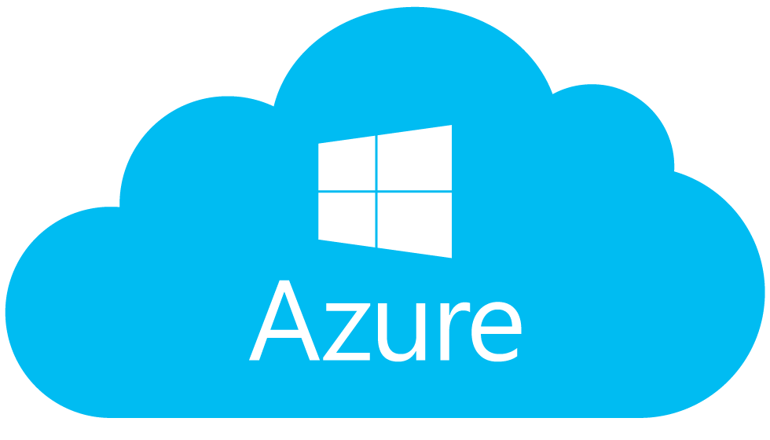

# Azure Deployment - Coffee Quality Inspection API

This directory contains Terraform configuration files to deploy the Coffee Bean Defect Detection API on Microsoft Azure using Container Instances and App Service.



## 📋 Architecture Overview

The deployment includes two options:

### Option 1: Azure Container Instances (Recommended for Scalability)
- **Azure Container Registry**: Docker image repository
- **Container Instances**: Serverless containerized applications
- **Application Gateway**: Load balancing and routing
- **Azure Storage**: Model and artifact storage
- **Azure Monitor**: Logging and monitoring
- **Key Vault**: Secrets management

### Option 2: Azure App Service (Recommended for Simplicity)
- **Azure Container Registry**: Docker image repository
- **App Service**: Managed web application hosting
- **Application Service Plan**: Compute resources
- **Application Gateway**: Optional load balancing
- **Azure Storage**: Model and artifact storage
- **Application Insights**: Monitoring and diagnostics

## 🚀 Prerequisites

1. **Azure Account** with an active subscription
2. **Terraform** (>= 1.0)
3. **Azure CLI** (`az` CLI) installed and configured
4. **Docker** installed locally

```bash
# Verify installations
terraform version
az --version
docker --version

# Authenticate with Azure
az login
az account set --subscription "YOUR_SUBSCRIPTION_ID"
```

## 📂 File Structure

```
azure/
├── main.tf                      # Main infrastructure configuration
├── variables.tf                 # Variable definitions
├── outputs.tf                   # Output values
├── terraform.tfvars             # Variable values (create this)
├── versions.tf                  # Terraform and provider versions
├── resource-group.tf            # Resource group setup
├── container-registry.tf        # ACR setup
├── iam.tf                       # Service principals and RBAC
├── storage.tf                   # Storage account configuration
├── container-instances.tf       # Container Instances setup (optional)
├── app-service.tf               # App Service setup (alternative)
├── app-gateway.tf               # Application Gateway (load balancing)
├── monitoring.tf                # Azure Monitor and alerts
├── key-vault.tf                 # Key Vault for secrets
└── README.md                    # This file
```

## 🔧 Configuration Steps

### 1. Set Azure Subscription

```bash
# List available subscriptions
az account list --output table

# Set the subscription
export AZURE_SUBSCRIPTION_ID="your-subscription-id"
az account set --subscription $AZURE_SUBSCRIPTION_ID
```

### 2. Create `terraform.tfvars`

Copy and customize the following values:

```hcl
# terraform.tfvars
azure_subscription_id   = "your-subscription-id"
azure_tenant_id         = "your-tenant-id"
azure_region            = "eastus"
resource_group_name     = "coffee-prediction-rg"
app_name                = "coffee-prediction"
environment             = "production"

# Container Configuration
container_port          = 9696
container_image_tag     = "latest"
container_cpu           = 1         # CPU cores
container_memory        = 1.5       # GB

# Deployment Type
deployment_type         = "app-service"  # or "container-instances"

# App Service Configuration
app_service_tier        = "B1"       # B1, B2, B3, S1, S2, S3, P1V2, P2V2, P3V2
app_service_instances   = 2

# Container Instances Configuration
container_instances_count = 2
restart_policy          = "OnFailure"

# Storage Configuration
enable_blob_storage     = true
storage_sku             = "Standard_LRS"

# Monitoring Configuration
enable_monitoring       = true
log_retention_days      = 30

# Key Vault Configuration
enable_key_vault        = true
enable_soft_delete      = true

# Tags
tags = {
  project     = "coffee-quality-inspection"
  environment = "production"
  managed-by  = "terraform"
}
```

### 3. Initialize Terraform

```bash
cd deployment/azure
terraform init
```

### 4. Register Azure Providers (if needed)

```bash
# Register required resource providers
az provider register --namespace Microsoft.ContainerInstance
az provider register --namespace Microsoft.ContainerRegistry
az provider register --namespace Microsoft.Web
az provider register --namespace Microsoft.Storage
az provider register --namespace Microsoft.KeyVault
az provider register --namespace Microsoft.Insights
az provider register --namespace Microsoft.Network
```

### 5. Build and Push Docker Image

```bash
# Set variables
export AZURE_REGION="eastus"
export RESOURCE_GROUP="coffee-prediction-rg"
export REGISTRY_NAME="coffeepredreg"  # Must be globally unique

# Create resource group (if not created by Terraform)
az group create --name $RESOURCE_GROUP --location $AZURE_REGION

# Create container registry
az acr create --resource-group $RESOURCE_GROUP \
  --name $REGISTRY_NAME --sku Basic

# Build the Docker image
docker build -t coffee-predictor:latest -f ../../deployment/flask/Dockerfile ../../

# Login to registry
az acr login --name $REGISTRY_NAME

# Tag the image
docker tag coffee-predictor:latest ${REGISTRY_NAME}.azurecr.io/coffee-prediction:latest

# Push to ACR
docker push ${REGISTRY_NAME}.azurecr.io/coffee-prediction:latest
```

### 6. Plan and Apply Terraform

```bash
# Review the infrastructure plan
terraform plan -out=tfplan

# Apply the configuration
terraform apply tfplan

# Save outputs
terraform output > outputs.json
```

## 📊 Available Terraform Commands

```bash
# View current state
terraform show

# List resources
terraform state list

# View specific resource
terraform state show azurerm_container_app.api

# Destroy infrastructure (WARNING: This will delete resources)
terraform destroy
```

## 🌐 Accessing the API

Once deployed, you can access the API through the Application Gateway or App Service URL:

```bash
# Get the API endpoint
API_URL=$(terraform output -raw api_endpoint)

# Example API calls
# Health check
curl ${API_URL}/health

# Make prediction
curl -X POST -F "file=@/path/to/coffee/image.jpg" ${API_URL}/predict
```

## 📈 Monitoring

Access Azure Monitor and Application Insights:

```bash
# View application logs
az webapp log tail --resource-group $RESOURCE_GROUP --name $APP_NAME

# View container logs
az container logs --resource-group $RESOURCE_GROUP --name $CONTAINER_NAME

# View Application Insights metrics
az monitor metrics list --resource /subscriptions/$SUBSCRIPTION_ID/resourceGroups/$RESOURCE_GROUP/providers/Microsoft.Insights/components/$APP_INSIGHTS_NAME
```

## 🔐 Security Considerations

1. **Service Principals**: Uses managed identities for authentication
2. **RBAC**: Least-privilege role-based access control
3. **Key Vault**: Secrets stored in Azure Key Vault
4. **Network Security Groups**: Firewall rules for traffic control
5. **TLS/HTTPS**: Application Gateway provides SSL/TLS termination
6. **Container Registry**: Private container registry with access controls
7. **Secrets Management**: Sensitive data handled via Key Vault

## 💰 Cost Optimization

- **App Service**: B1 tier starts at ~$12/month
- **Container Instances**: Pay per second of execution (~$0.0000011/second per vCPU)
- **Storage**: Standard storage ~$0.023/GB/month
- **Application Insights**: Free tier includes 5GB/month
- **Azure Monitor**: Pay per data ingestion

### Cost Estimation

- **Small deployment (1 vCPU, 512MB RAM)**: ~$15-30/month
- **Medium deployment (2 vCPU, 2GB RAM)**: ~$30-50/month
- **Large deployment (4 vCPU, 4GB RAM)**: ~$60-100/month

## 🛠 Troubleshooting

### Deployment fails with authentication errors?

```bash
# Check current Azure context
az account show

# Re-authenticate
az login --use-device-code

# Check permissions
az role assignment list --assignee $(az account show --query user.name -o tsv)
```

### Image not found in Container Registry?

```bash
# List repositories
az acr repository list --name $REGISTRY_NAME

# List images
az acr repository show-tags --name $REGISTRY_NAME --repository coffee-prediction

# Check image push logs
az acr task logs --registry $REGISTRY_NAME
```

### Application Gateway health checks failing?

```bash
# Check backend health status
az network application-gateway show-backend-health \
  --name coffee-prediction-appgw \
  --resource-group $RESOURCE_GROUP

# Update health check settings
# Modify app-gateway.tf and reapply
```

### High CPU or memory usage?

```bash
# Check metrics in Application Insights
az monitor metrics list --resource $APP_INSIGHTS_ID \
  --metric "% CPU Time" \
  --interval PT1M \
  --start-time 2024-01-01T00:00:00Z

# Scale up by updating variables.tf:
# app_service_tier = "S1"  # or higher
# container_memory = 2     # increase memory
```

## 🚀 Deployment Workflows

### Initial Deployment (App Service)

```bash
# 1. Set up resource group
export RESOURCE_GROUP="coffee-prediction-rg"
az group create --name $RESOURCE_GROUP --location eastus

# 2. Create terraform.tfvars
cp terraform.tfvars.example terraform.tfvars
# Edit terraform.tfvars

# 3. Initialize Terraform
terraform init

# 4. Build and push Docker image
docker build -t coffee-predictor:latest -f ../../deployment/flask/Dockerfile ../../
az acr login --name $REGISTRY_NAME
docker tag coffee-predictor:latest ${REGISTRY_NAME}.azurecr.io/coffee-prediction:latest
docker push ${REGISTRY_NAME}.azurecr.io/coffee-prediction:latest

# 5. Deploy
terraform plan -out=tfplan
terraform apply tfplan
```

### Initial Deployment (Container Instances)

```bash
# Same steps as above, but set:
# deployment_type = "container-instances"
```

### Updating the Application

```bash
# 1. Build and push new image
docker build -t coffee-predictor:v2 -f ../../deployment/flask/Dockerfile ../../
docker tag coffee-predictor:v2 ${REGISTRY_NAME}.azurecr.io/coffee-prediction:v2
docker push ${REGISTRY_NAME}.azurecr.io/coffee-prediction:v2

# 2. Update image tag in terraform.tfvars
# container_image_tag = "v2"

# 3. Reapply Terraform
terraform plan -out=tfplan
terraform apply tfplan
```

### Scaling the Application

```bash
# For App Service:
# Update in terraform.tfvars:
# app_service_tier = "S1"      # higher tier
# app_service_instances = 3    # more instances

# For Container Instances:
# container_instances_count = 5  # more instances

terraform plan -out=tfplan
terraform apply tfplan
```

## 🔍 Advanced Configuration

### Custom Domain with Azure App Service

```bash
# Verify custom domain
az webapp validation show --resource-group $RESOURCE_GROUP --name $APP_NAME

# Add custom domain
az webapp config hostname add --resource-group $RESOURCE_GROUP \
  --webapp-name $APP_NAME --hostname yourdomain.com
```

### Configure HTTPS with App Service

```bash
# Create or import SSL certificate
az webapp config ssl bind --resource-group $RESOURCE_GROUP \
  --name $APP_NAME --certificate-name $CERT_NAME --ssl-type SNI
```

### Enable VNet Integration

```bash
# Integrate App Service with VNet
az webapp vnet-integration add --resource-group $RESOURCE_GROUP \
  --name $APP_NAME --vnet $VNET_NAME --subnet $SUBNET_NAME
```

## 📚 Additional Resources

- [Azure Container Registry Documentation](https://learn.microsoft.com/en-us/azure/container-registry/)
- [Azure Container Instances Documentation](https://learn.microsoft.com/en-us/azure/container-instances/)
- [Azure App Service Documentation](https://learn.microsoft.com/en-us/azure/app-service/)
- [Terraform Azure Provider](https://registry.terraform.io/providers/hashicorp/azurerm/latest/docs)
- [Azure Best Practices](https://learn.microsoft.com/en-us/azure/cloud-adoption-framework/)

## 📝 Next Steps

1. Set up Azure subscription and authenticate
2. Update `terraform.tfvars` with your configuration
3. Build and push Docker image to ACR
4. Run `terraform plan` to review infrastructure
5. Deploy with `terraform apply`
6. Monitor via Application Insights

## 💡 Tips

- **Warm Starts**: Use App Service for faster cold starts
- **Scalability**: Container Instances better for burst traffic
- **Cost**: Compare App Service vs Container Instances based on usage
- **Monitoring**: Enable Application Insights for detailed diagnostics
- **Secrets**: Store API keys and credentials in Key Vault
- **Auto-scaling**: Configure App Service Plan auto-scale rules for dynamic scaling

---

For questions or issues, refer to [Azure Documentation](https://learn.microsoft.com/en-us/azure/) or [Terraform Azure Provider](https://registry.terraform.io/providers/hashicorp/azurerm/latest/docs).
